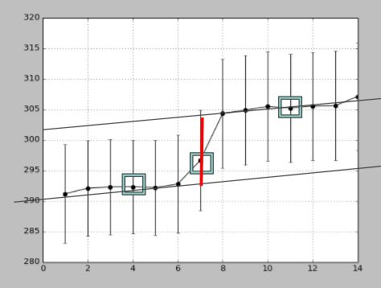
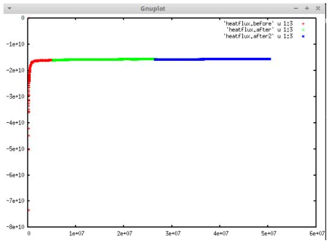

Paul Project
==================

**Python Scripts**

* Automated post-processing scripts so they can be run more easily

* Both scripts now automatically determine the number of bins using tmp.profile file

* Both scripts can now read the tmp.profile that the lammps script outputs by default (no manual alterations or header deletion is necessary)

* Both scripts now automatically generate a heatflux file if one doesn’t exist already (using the log.lammps file)

* Both scripts now automatically write their calculated kappa value to a data file, writing the kappa value and the current date/time.

* The KR script will now take two data points per bulk region to generate the slopes and calculate ΔT at the interface

**NEMD**

Set up and ran simulations for Silicon Germanium Superlattices of varying number of atoms.
Systems: 3072, 8192, 20992

Also ran bulk Silicon and Germanium

**Transmission**
Set up and ran Transmission scripts to investigate phonon frequencies at interface and confined regions.

THIS WAS ADDED BY PAUL REMOTELY TEST TEST. ANOTHER ONE
